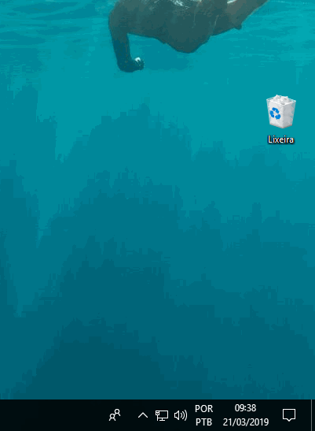

# Comunicados-Diarios
Pequeno sistema para enviar comunicados para computadores de uma rede corporativa

# Iniciando
O projeto possui um webservice e duas opções de client a serem usados nos computadores da rede.

# Screenshots
* Modelo Balão

* Modelo Chat

